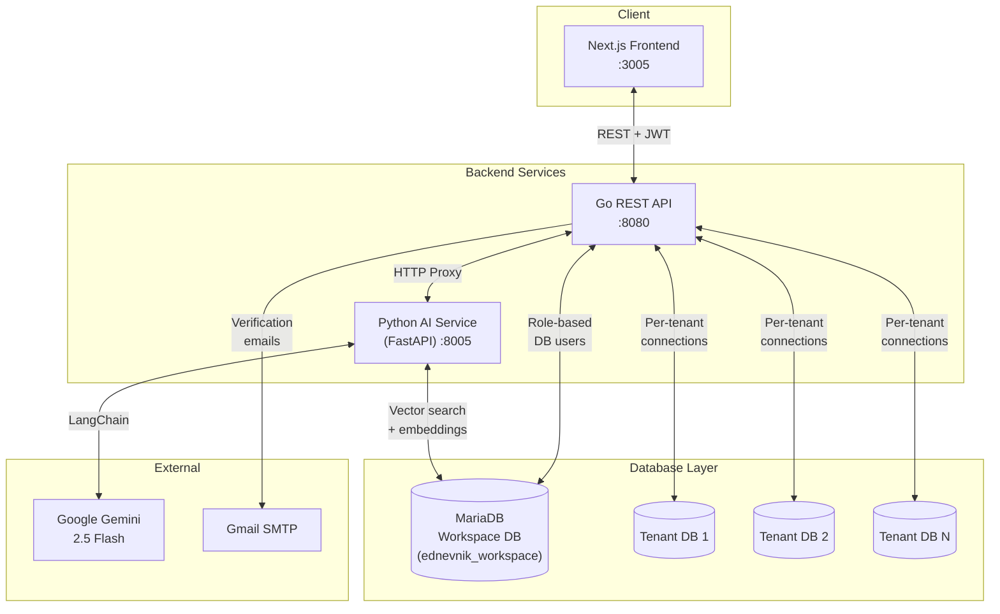

# eDnevnik - Multi-Tenant Electronic Gradebook Platform

A full-stack, multi-tenant electronic gradebook platform built as a **bachelor's thesis project**. Designed for the **Bosnia and Herzegovina education system**, it supports both primary and secondary schools with role-based access control, per-tenant database isolation, and an AI-powered RAG chatbot assistant.

---

## Overview

eDnevnik (electronic diary/gradebook) digitizes the traditional paper gradebook used in Bosnian schools. It enables schools to manage grades, attendance, lessons, schedules, and student records through a modern web interface with role-specific dashboards for administrators, teachers, students, and parents.

Each school (tenant) receives its own isolated database while sharing a common workspace database for cross-cutting concerns like user accounts, curricula, and canton data. An integrated AI chatbot powered by Google Gemini and retrieval-augmented generation (RAG) provides contextual assistance to all user roles.

---

## Key Features

- **Multi-Tenant School Management** - Full CRUD for schools with per-tenant color theming, two school types (primary/secondary), and specialization support (regular, religion, musical)
- **Curriculum & Education Plans** - Canton-based NPP management, 28+ secondary school course types, curriculum-subject mapping and tenant assignment
- **Section (Class Group) Management** - Class instances per school year with homeroom teacher assignment and archival workflow that triggers enrollment for the next education level
- **Teacher & Pupil Management** - Self-registration with email verification, multi-tenant support, invitation workflows (admin invites, user accepts/declines), parent access via UUID codes
- **Grade Management** - Four grade types (exam, oral, written assignment, final), 1–5 scale, database triggers preventing duplicate finals, full audit trail via MariaDB temporal tables
- **Behaviour Grades** - Five-level scale, auto-created via DB trigger on section assignment, system-versioned edit history
- **Attendance Tracking** - Present/absent/excused/unexcused statuses linked to lessons, with excuse workflow and weekly/subject grouping
- **Lesson & Schedule Management** - Lesson records with weekly grouping, interactive drag-and-drop schedule builder, regular/additional/remedial schedule types
- **Certificate Generation** - Formal report cards with PDF rendering via Puppeteer, available for archived sections
- **AI Chatbot (RAG)** - Google Gemini 2.5 Flash LLM, LaBSE multilingual embeddings (768-dim), MariaDB vector store with HNSW index, role-based document filtering
- **PDF Export** - Server-side rendering for schedules, certificates, and complete gradebooks

---

## Architecture

---

## Tech Stack

| Layer | Technology | Purpose |
| --- | --- | --- |
| Backend API | Go 1.23, Gorilla Mux | REST API server, routing, middleware |
| Authentication | golang-jwt/v5, bcrypt, NextAuth.js v4 | JWT issuance (Go), session management (Next.js) |
| AI Service | Python 3, FastAPI, Uvicorn | RAG chatbot microservice |
| LLM | Google Gemini 2.5 Flash | Natural language generation |
| Embeddings | LaBSE (sentence-transformers) | 768-dim multilingual embeddings |
| RAG Framework | LangChain | Retrieval pipeline, history-aware chains |
| Frontend | Next.js 15 (App Router), React 19 | Server/client components, SSR |
| Styling | Tailwind CSS v4 | Utility-first CSS with dynamic theming |
| Forms | react-hook-form v7 | Form state management and validation |
| PDF Generation | Puppeteer v24 | Server-side HTML-to-PDF rendering |
| Database | MariaDB (with native VECTOR type) | RDBMS + vector search (HNSW, cosine) |
| Email | Gmail SMTP (net/smtp) | Account verification emails |

---

## Multi-Tenant Architecture

The platform uses a **database-per-tenant** isolation pattern - the strongest form of multi-tenant data separation:

- **Workspace DB** (`ednevnik_workspace`) - shared global database holding accounts, teachers, pupils, curricula, cantons, semesters, and the AI vector store (27 tables)
- **Per-Tenant DBs** (`ednevnik_tenant_db_tenant_id_N`) - one isolated database per school containing sections, grades, lessons, attendance, schedules, and classrooms (16 tables each)

### Key Design Decisions

- **Cross-database foreign keys** - tenant DBs reference the workspace DB for shared entities
- **Role-based MariaDB users** - five DB users (`eacon`, `tenant_admin`, `teacher`, `pupil`, `service_reader`) with granular GRANT privileges, enforced at the connection level
- **Temporal tables** - MariaDB `WITH SYSTEM VERSIONING` on grades, behaviour, attendance, lessons, and schedules provides automatic audit trails without application-level code
- **Tenant factory pattern** - a `ConfigurableTenant` struct implements the `ITenant` interface (92 methods), parameterized by tenant type configuration
- **Connection caching** - `sync.Map`-based DB connection pool with per-role connection strings

### Core Design Patterns

- **Factory Pattern**: The platform uses a `TenantFactory` to dynamically instantiate and provision schools. Based on the school type (primary or secondary), the factory provides a `ConfigurableTenant` instance mapped to the correct underlying SQL schema and behavior rules.
- **Strategy Pattern**: The `ITenant` interface abstracts 90+ tenant-specific operations. Different configurations inject specific querying strategies, enabling the exact same API endpoints to seamlessly handle differing rules (e.g., secondary schools have "courses/smjer", whereas primary schools do not) without cluttering the business logic with if/else statements.

---

## User Roles

| Role | Description | Landing Page |
| --- | --- | --- |
| `root` | Superadmin - full system access, tenant CRUD, global configuration | `/tenants` |
| `tenant_admin` | School administrator - manages sections, teachers, pupils, schedules | `/tenant_admin_administration` |
| `teacher` | Teacher - manages lessons, attendance, grades; can be homeroom teacher | `/teacher_home` |
| `pupil` | Student - read-only access to own grades, attendance, schedule, certificates | `/pupil_home` |
| `parent` | Parent - logs in via UUID access code, same view as pupil | `/pupil_home` |

Authorization is enforced at three layers:

1. **Endpoint level** - JWT `account_type` checked against per-route allow-lists
2. **Database level** - DB connection opened as the MariaDB user matching the JWT role
3. **Business logic level** - ownership checks (e.g., pupils can only query their own data)

---

## Acknowledgements

This project was developed as a bachelor's thesis, demonstrating the design and implementation of a multi-tenant SaaS platform with database-per-tenant isolation, role-based access control at both the application and database levels, and modern AI integration through retrieval-augmented generation.
